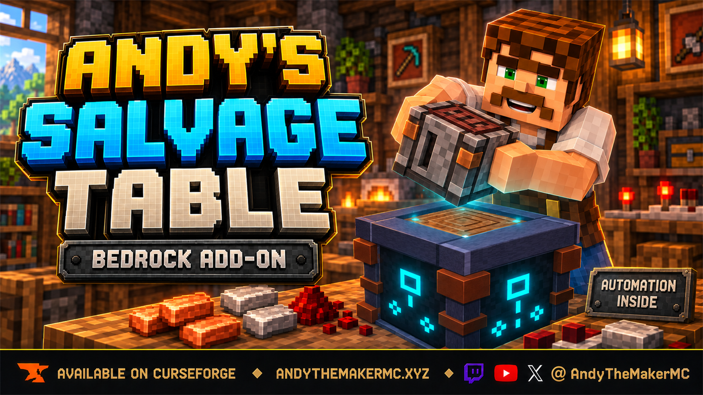
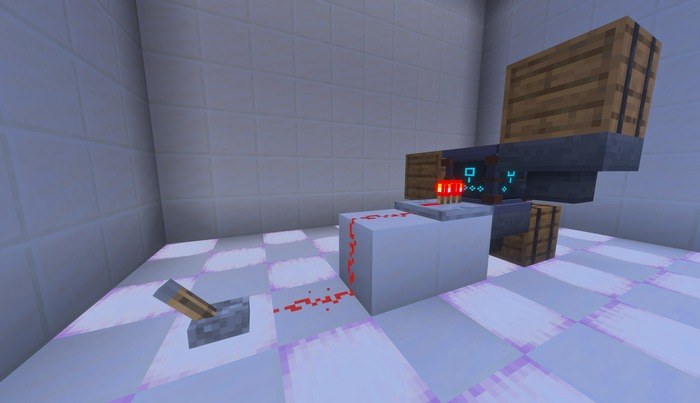
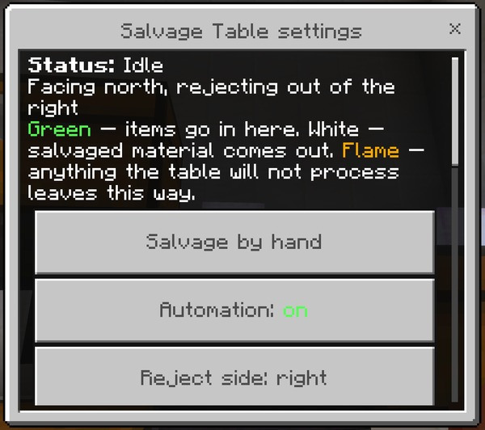

  

# Andy's Salvage Table

**Break crafted items back down into a fair share of the materials they were made from.**

Andy's Salvage Table is a workstation that reverses crafting. Put a crafted item in, and it shows you exactly what you will get back before you commit to anything — then hands it over. The materials come from Minecraft's own crafting recipes, so a Chest returns planks, a Diamond Pickaxe returns diamonds and a stick, and sixteen Glass Panes return the six Glass they actually cost. It never returns more than the recipe took, damaged gear returns less, and the whole thing runs as a farm once you are ready for that.

  

_Items in through any side, recovered materials out through the bottom, and redstone to switch it off._

**Current release:** 0.7.15
**Download:** [Andys_Salvage_Table_0.7.15.mcaddon](Andys_Salvage_Table_0.7.15.mcaddon)
**SHA-256:** `4B370B597BEFA0C6B7C9CCE9BD3EF4E73DB3492ED32C94BAC94C2DD12D4711DC`

Minecraft Bedrock **1.26.30 or newer** is required. Both the Behavior Pack and the Resource Pack must be active. No cheats, commands, experimental gameplay toggles, or additional dependencies are required. Standard graphics and Vibrant Visuals are supported.

The complete player, user, and admin documentation is in the [GitHub Wiki](https://github.com/CharlesJGantt/Andys-Salvage-Table/wiki).

## Features

- **909 salvage recipes**, generated from Minecraft's own crafting data rather than written by hand, so anything the game lets you craft the table lets you break down.
- **See the result before you commit.** The nine material slots show exactly what you will receive, and hovering the Recovery % icon gives the rate, the item's condition, what is consumed, and the full list coming back.
- **Honest arithmetic.** Recovery is a percentage of the original recipe, scaled by how damaged the item is, and it can never exceed what the recipe took. Sixteen Glass Panes came from six Glass, so one pane never returns one Glass.
- **Nothing is ever half-done.** The whole result is checked against your inventory before the item is consumed. If it will not fit, nothing is salvaged and the item stays where it is.
- **Enchanted, renamed, and container items are protected** by default, so nothing valuable is destroyed by accident. A world owner can allow each one deliberately.
- **Full automation.** Hoppers or chests on four faces feed it, recovered materials leave through the bottom, and anything it will not process leaves through a side you choose — so a rejected item can never jam a farm.
- **Redstone control** with three modes, per machine.
- **Per-machine filters**: presets, category switches, and item allow/deny lists, so one table takes only damaged equipment while another takes only blocks.
- **An operator menu and full dedicated-server console support**, so a world owner can tune the economy or switch any part of it off.
- Vibrant Visuals / PBR textures, and achievement-friendly.

## Crafting Recipes

### Salvage Table

| | | |
| --- | --- | --- |
| Copper Ingot | Grindstone | Copper Ingot |
| Iron Ingot | Stonecutter | Crafting Table |
| Blackstone | Blackstone | Blackstone |

## Installation

### Windows, Android, iPhone, and iPad

1. Download [Andys_Salvage_Table_0.7.15.mcaddon](Andys_Salvage_Table_0.7.15.mcaddon).
2. Open it with Minecraft Bedrock and wait for both packs to import.
3. Create or edit a world.
4. Activate **Andy's Salvage Table [BP]** under Behavior Packs.
5. Confirm **Andy's Salvage Table [RP]** is active under Resource Packs.
6. Craft a Salvage Table and place it.

Back up an important world before installing or updating any add-on.

### Xbox, PlayStation, and Nintendo Switch

Import and activate the add-on on Windows or mobile, upload the prepared world to a Realm, and join that Realm from the console.

## Controls

1. **Use the table** to open it. Put an item in the **Item** slot.
2. The **Salvaged Materials** grid fills with exactly what you will receive.
3. **Hover the gold Recovery % icon** for the numbers: the recovery rate, the item's condition, how many are consumed, and everything coming back.
4. **Take any of the materials** to complete the salvage. The item is consumed once and the whole result is paid into your inventory.
5. **Crouch with an empty hand and use the table** to open its settings — automation, filters, speed, redstone, and the world-owner menu if you are an operator.
6. **Crouch with a block in hand** to build against the table instead, exactly as you would with any other workstation.

  

## Compatibility and limitations

- Minecraft Bedrock 1.26.30 or newer
- Both the Behavior Pack and the Resource Pack must be active
- Standard graphics and Vibrant Visuals/PBR
- Single-player, multiplayer, Realms, and compatible Bedrock servers
- No cheats, commands, experimental toggles, or required dependencies
- Items added by other add-ons are not salvageable unless that add-on adds support for it. **Add-on developers** can do so in about ten lines — see [Making Your Add-on Compatible](https://github.com/CharlesJGantt/Andys-Salvage-Table/wiki/Making-Your-Add-on-Compatible).
- Banners, Suspicious Stew, and Maps are deliberately left out. The table cannot tell a red Banner from a blue one, and would return the wrong dye.
- Items obtained without crafting — smelted, brewed, found, or mined — have no recipe to reverse.
- Comparators cannot read a Salvage Table.

See [Compatibility and Troubleshooting](https://github.com/CharlesJGantt/Andys-Salvage-Table/wiki/Compatibility-and-Troubleshooting) for detailed diagnostics.

<!-- ================================================================================
EVERYTHING BELOW THIS LINE: DO NOT EDIT except <PRODUCT> and <YEAR>.
Byte-identical to the closing block in curseforge-description.template.md.
=================================================================================== -->

## Support AndyTheMakerMC

All of my Minecraft Bedrock add-ons are free to download and use. If one of my add-ons has improved your world, saved you time, or added something you wish Minecraft already had, consider supporting continued development. Your support helps fund the time and tools required to maintain existing add-ons, test new Minecraft Bedrock releases, fix bugs, create documentation and artwork, and continue building new add-ons.

**Help me keep these add-ons free, updated, and actively maintained** — support through [Buy Me a Coffee](https://www.buymeacoffee.com/AndyTheMakerMC) or a direct donation through [Stripe](https://buy.stripe.com/4gM4gz0qu0xwgxw0IfcMM00). Prefer another way? [Ko-fi](https://ko-fi.com/andythemaker) · [Patreon](https://www.patreon.com/cw/AndyTheMakerMC) · [GitHub Sponsors](https://github.com/sponsors/CharlesJGantt). Every bit of support is appreciated, but it is never required.

Enjoying the add-on? Ratings, favorites, recommendations, and kind comments also help more Bedrock players discover Andy's work.

### Explore more of Andy's add-ons

Visit [AndyTheMakerMC.xyz](https://andythemakermc.xyz/) for more Minecraft Bedrock add-ons, `.mcstructure` downloads, HoloPrint files, world lore, tutorials, guides, videos, and other creations.

### Follow AndyTheMakerMC

Follow **@AndyTheMakerMC** for new add-on releases, development updates, tutorials, showcases, streams, and more Minecraft adventures, and join the community on Discord and Facebook:

- [YouTube](https://www.youtube.com/@AndyTheMakerMC)
- [Twitch](https://www.twitch.tv/AndyTheMakerMC)
- [TikTok](https://www.tiktok.com/@AndyTheMakerMC)
- [Instagram](https://www.instagram.com/andythemakermc/)
- [X (Twitter)](https://x.com/AndyTheMakerMC)
- [Discord](https://discord.gg/KVFNHf67Y)
- [Facebook Group](https://www.facebook.com/groups/1728623358327048)

## End-user permission

You may download the official, unmodified release of Andy's Salvage Table from its official CurseForge or authorized GitHub project page and install, activate, and use it in personal single-player worlds, multiplayer worlds, Realms, and compatible Bedrock servers.

This permission includes Minecraft's normal automatic delivery of the official, unmodified add-on to players joining a world, Realm, or server where it is active. It does not permit offering the add-on file separately or distributing it as part of a world download, modpack, bundle, mirror, archive, or server download.

## Content-creator permission

Content creators may use an official, unmodified release of Andy's Salvage Table in original gameplay videos, livestreams, screenshots, tutorials, reviews, showcases, articles, guides, social posts, and other original content, including monetized content.

Credit to **AndyTheMakerMC** and a link to the official CurseForge project page are appreciated whenever practical. This permission covers display of normal gameplay and commentary; it does not grant permission to redistribute, modify, extract, or republish the add-on or its assets.

## License — All Rights Reserved

**All Rights Reserved. Copyright © 2026 Andy / AndyTheMakerMC.**

You may not redistribute, reupload, rehost, mirror, resell, sublicense, bundle, repackage, modify and publish, translate, adapt, decompile, disassemble, reverse engineer, extract, or reuse the add-on, its source code, scripts, documentation, branding, textures, models, pack icons, or promotional artwork without prior written permission from the copyright holder.

You may not create derivative works or incorporate any portion of the project into another add-on, Behavior Pack, Resource Pack, application, product, modpack, download, or project without prior written permission. The end-user and content-creator permissions above are limited permissions; they do not transfer ownership or grant redistribution rights.

The promotional artwork is original AI-assisted concept artwork directed for this project. It is not an in-game screenshot.

Minecraft is a trademark of Microsoft Corporation. This project is not affiliated with, endorsed by, sponsored by, or associated with Microsoft or Mojang Studios.

See [LICENSE.md](LICENSE.md) for the complete license and permitted-use terms.
